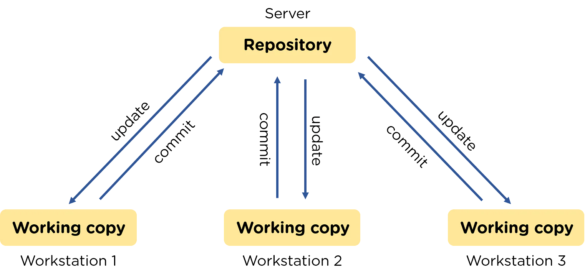

# Importance of Version Control Systems while Coding
Written by Aran Arora, Sahil Singh Rawat & Priya Peter Menezes

## Introduction to Version Control
Version control is _\[both\]_ a system and practice for managing changes in a _\[centralized space that allows contributors to access, modify and contribute\]_ file or digital content _\[simultaneously\]_. By using a set of version control practices and tools, one can revert to a previous state of a project and view or manipulate its content. These are crucial tools that ensure that play a big part in ensuring the quality of the final product.

~~Version control systems provide a centralized space for the project which allows contributors to access, modify and contribute simultaneously.~~

In fast-paced development environments, these systems make it easier for teams to work efficiently. Most often, these systems are designed to record every modification to the contents of the project. When there is an issue, those working on the project can compare previous versions to fix issues, errors, or inconsistencies with minimal disruption.
 (__Source__:  [Altassian](https://www.atlassian.com/git/tutorials/what-is-version-control)).

 
__Image Source:__ [Simplilearn](https://www.simplilearn.com/ice9/free_resources_article_thumb/Version_Control.png)

## Source Code Version Control
Source-code version control is a tool that is specifically used to manage code files. 

- It keeps track of the history of code changes, including the author and time of the modifications. 
- It allows the creation of multiple versions of the code, each in its branch, to enable teams to work on different features without disrupting the main code branch.
- The tool also enables merging changes made in separate _\[development\]_ branches back into the main code branch and resolves any conflicts that arise during this process (__Source__:  [Open AI](https://chat.openai.com)).

Today, there are multiple source-code version control tools available on the market. Some of the most popular ones are Git, Subversion, and Mercurial. Each of these has its own unique operations, rules, and advantages (__Source__:  [Open AI](https://chat.openai.com)).

The nature of the project one is working on really defines which version control system is best for that specific project's needs ([ref?]()). However, in this article, we will be focusing on the GitHub environment.

## Advantages of using a Version Control System 

~~Using a source code version control system is essential in modern-day software development practices. These tools offer powerful features and advantages to teams working on a code project.~~

~~Here's a list of a few features that a version control system can offer for your project:~~
- ~~It provides the ability to supervise and protect the codebase (__Source:__ [Simplilearn](https://www.simplilearn.com/tutorials/devops-tutorial/version-control)).~~
- ~~As already mentioned, it gives developers the ability to record all changes made to the code and save the code in those particular states (__Source:__ [Simplilearn](https://www.simplilearn.com/tutorials/devops-tutorial/version-control)).~~
- ~~By using a version control tool, a developer can analyze version history, giving them the power to revisit a code in any of the previous saved states (__Source:__ [Simplilearn](https://www.simplilearn.com/tutorials/devops-tutorial/version-control))~~
- ~~Not only does it provide a feature to revisit code, but it also allows developers to roll back the code to a previous state.~~
- All these features give the developers an environment to experiment and make errors without affecting the final working code.
- All these updates and experiments can easily be reviewed when using a version control tool.

A version control tool provides many more advantages and powerful features to the developer, but one of the biggest advantages of using this tool is that multiple team members can collaborate on a single project and utilize all these features simultaneously ([ref?]()).

Now that we've talked about what a version control system is and its advantages, let's look at how to use Git for version control activities.
1. Create a repository.
You can create a repository for the code on the [GitHub](https://www.github.com) platform by following the simple prompts for creating the repository.
- Step 2 - Clone the repository.
Once a repository is created, you need to replicate it to your local machine. You can create files and folders in the repository and start writing your code.
- Step 3 - Save and commit.
As you write your code, save your files with every small code block change and commit those changes. This is an important step, as each commit becomes a new state of the code that can later be revisited. It's important to create commits with short but descriptive commit titles and descriptions.
- ~~Step 4 - View commit history.~~~
~~As you develop your project, you can keep track of the history of your commits to ensure the changes you've made to the code.~~
- Step 5 - Make any required changes.
If you identify that your code requires changes, revisit those parts, make the changes, and recommit your code.
- Step 6 - Push changes.
Finally, all these commits need to be pushed to the remote repository. Once in the cloud, you can access your project from any other device.

(Source:  [Open Source](https://opensource.com/article/18/1/step-step-guide-git)). _\[I question the accuracy of this reference\]_

## Code Example for incremental commits

Here's a simple example of what it means to save your code with small blocks of code. For instance, let's say you're writing a simple Java program for a calculator that performs tasks such as addition, subtraction, multiplication, and division.

_\[Why are these separate commits?\]_
### Commit 1
```java
// Create Program Structure

import java.util.Scanner;

public class Calculator {

  public static void main(String[] args) {
    Scanner input = new Scanner(System.in);

    // Ask the user to input the type of operation they want to perform

    // Read the user's choice

    // Ask the user to input the two numbers

    // Perform the requested operation
  }
}
```

### Commit 2
```java
// Ask the user to input the type of operation they want to perform
    System.out.println("Please select the type of operation you want to perform:");
    System.out.println("1. Addition");
    System.out.println("2. Subtraction");
    System.out.println("3. Multiplication");
    System.out.println("4. Division");

    // Read the user's choice
    int choice = input.nextInt();
```

### Commit 3
```java
// Ask the user to input the two numbers
    System.out.println("Please enter the first number:");
    double num1 = input.nextDouble();

    System.out.println("Please enter the second number:");
    double num2 = input.nextDouble();
```

### Commit 4
```java
// Perform the requested operation
    switch (choice) {
      case 1:
        System.out.println("Result: " + (num1 + num2));
        break;
      case 2:
        System.out.println("Result: " + (num1 - num2));
        break;
      case 3:
        System.out.println("Result: " + (num1 * num2));
        break;
      case 4:
        System.out.println("Result: " + (num1 / num2));
        break;
      default:
        System.out.println("Invalid choice");
    }
```

With each commit, a new state is created. Using GitHub's commit history, the developer can go back to any previous state, make changes, and continue from there.
For example, if the developer wants to allow operations for three numbers instead of two, they can go back to commit 3 where the code would look something like this:

```java
import java.util.Scanner;

public class Calculator {

  public static void main(String[] args) {
    Scanner input = new Scanner(System.in);

    // Ask the user to input the type of operation they want to perform
    System.out.println("Please select the type of operation you want to perform:");
    System.out.println("1. Addition");
    System.out.println("2. Subtraction");
    System.out.println("3. Multiplication");
    System.out.println("4. Division");

    // Read the user's choice
    int choice = input.nextInt();

    // Ask the user to input the two numbers
    System.out.println("Please enter the first number:");
    double num1 = input.nextDouble();

    System.out.println("Please enter the second number:");
    double num2 = input.nextDouble();

    // Perform the requested operation

  }
}
```

They can add additional statements to input a third number

```java
System.out.println("Please enter the third number:");
    double num3 = input.nextDouble();
```

He can then save this as a new commit, add the next set of statements, and save them in commit 4. This would make the program look like the following:

```java
import java.util.Scanner;

public class Calculator {

  public static void main(String[] args) {
    Scanner input = new Scanner(System.in);

    // Ask the user to input the type of operation they want to perform
    System.out.println("Please select the type of operation you want to perform:");
    System.out.println("1. Addition");
    System.out.println("2. Subtraction");
    System.out.println("3. Multiplication");
    System.out.println("4. Division");

    // Read the user's choice
    int choice = input.nextInt();

    // Ask the user to input the two numbers
    System.out.println("Please enter the first number:");
    double num1 = input.nextDouble();

    System.out.println("Please enter the second number:");
    double num2 = input.nextDouble();

    // Perform the requested operation
    // You might want to check and test this code...
    switch (choice) {
      case 1:
        System.out.println("Result: " + (num1 + num2 + num3));
        break;
      case 2:
        System.out.println("Result: " + (num1 - num2 - num3));
        break;
      case 3:
        System.out.println("Result: " + (num1 * num2 * num3));
        break;
      case 4:
        System.out.println("Result: " + (num1 / num2 / num3));
        break;
      default:
        System.out.println("Invalid choice");
    }
  }
}
```

## Version Control Best Practices

Now that we've looked at how to create commits in GitHub for better version control, let's look at the best practices.

*__\[This whole section is too similar to the source material\]__*
### Commit Relatively:
A commit should be relative to the work done. It means that the commit should be descriptive enough to explain what the changes in the code really are. If a person is trying to solve multiple problems, then each commit made should define the exact unique problem that is solved (Source:  [Git-Tower](https://www.git-tower.com/learn/git/ebook/en/command-line/appendix/best-practices)).

### Commit small but often:
Committing code in small increments reduces the risk of integration conflicts. Regular, small commits and well-documented changes would make it easier to revert if any conflicts do occur. Committing frequently helps to keep changes small and focused Which in turn allows for frequent integration with other contributors. Infrequent, large commits create challenges in resolving disputes and understanding changes. (Source:  [Git-Tower](https://www.git-tower.com/learn/git/ebook/en/command-line/appendix/best-practices), [Gitlab](https://about.gitlab.com/topics/version-control/version-control-best-practices))

### Never commit incomplete work:
Only commit code fully functional code to the repository. This does not mean that you have to complete a big feature before committing. In fact, it is recommended to split the implementation of the feature into smaller, manageable chunks and commit early and frequently to keep the code up to date. (Source:  [Git-Tower](https://www.git-tower.com/learn/git/ebook/en/command-line/appendix/best-practices))

### Use of Branches:
Branching is a crucial feature of Git. It helps keep different lines of development separate and reduces confusion. To make the most of this feature, branches should be utilized in your development process for various tasks such as adding new features, fixing bugs, conducting experiments or exploring ideas. (Source:  [Git-Tower](https://www.git-tower.com/learn/git/ebook/en/command-line/appendix/best-practices))

In conclusion, A version control system like Git can greatly enhance software development processes by allowing for efficient tracking of code changes, enabling collaboration, and providing greater control over project history. By leveraging features provided by these version control systems, developers can create better development workflows, reduce errors in code and always remain up-to date. 

# Resources

1. [Altassian](https://www.atlassian.com/git/tutorials/what-is-version-control)

2. [Simplilearn](https://www.simplilearn.com/ice9/free_resources_article_thumb/Version_Control.png)

3. [Open AI](https://chat.openai.com)

4. [Open Source](https://opensource.com/article/18/1/step-step-guide-git)

5. [Gitlab](https://about.gitlab.com/topics/version-control/version-control-best-practices)

6. [Git-Tower](https://www.git-tower.com/learn/git/ebook/en/command-line/appendix/best-practices)

